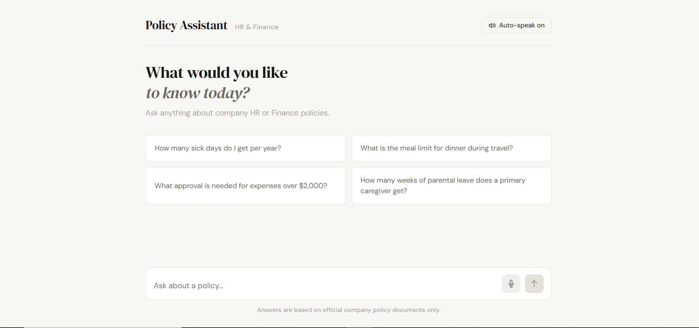
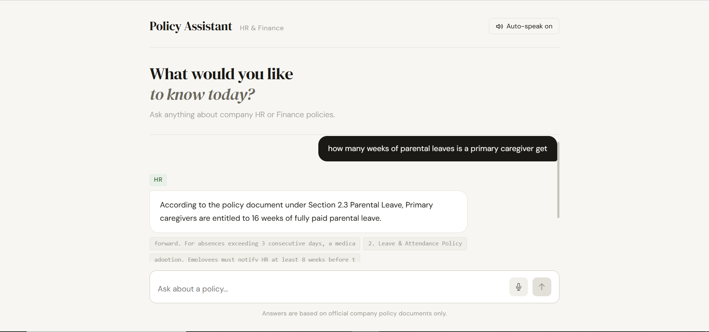

# PolicyMind – AI-Powered HR & Finance Policy Assistant

An intelligent RAG-powered chatbot that answers employee questions about HR and Finance policies with pinpoint accuracy, built on CRAG, hybrid search, and real company documents.

---
 
## Screenshots

### Welcome Screen


### Chat in Action


---

## Overview

PolicyMind is an enterprise-grade internal chatbot that allows employees to ask natural language questions about company HR and Finance policies. It retrieves answers strictly from official policy documents — no hallucination, no guesswork.

Built with **Corrective RAG (CRAG)** using **LangGraph**, it grades retrieved chunks for relevance, rewrites queries when needed, and only generates an answer when confident the context is correct.

---

## Architecture

```
Employee Question
        ↓
LLM Namespace Classifier (HR or Finance)
        ↓
Hybrid Search — Cohere Dense + BM25 Sparse (Pinecone)
        ↓
Chunk Grader (Groq LLM)
        ↓
    Relevant? ─── Yes ──→ Generate Answer (Groq)
        │
        No
        │
    Rewrite Query ──→ Hybrid Search again
        │
    Still irrelevant ──→ "Please contact HR/Finance"
```

---

## Tech Stack

| Layer | Tool |
|---|---|
| Orchestration | LangGraph |
| LLM | Groq `llama-3.3-70b-versatile` |
| Embeddings | Cohere `embed-english-v3.0` (1024 dims) |
| Sparse Search | Pinecone BM25 Encoder |
| Vector Database | Pinecone (Serverless, dotproduct metric) |
| Framework | LangChain |
| Backend API | FastAPI |
| Frontend | React + Vite |
| Speech Input | Web Speech API (STT) |
| Speech Output | Web Speech API (TTS) |
| Evaluation | Custom scorer on 20 golden QA pairs |
| Package Manager | uv |

---

## Features

- Natural language Q&A over company policy documents
- Hybrid search — semantic + keyword combined
- CRAG loop — grades chunks, rewrites bad queries automatically
- LLM-based namespace routing — HR vs Finance classified by intent
- Voice input — click mic, speak, auto-sends on silence
- Voice output — auto-speaks answers aloud, toggle on/off
- Listen button — replay any answer on demand
- Policy ID citations — answers always reference source policy
- Fallback handling — out-of-scope questions handled gracefully
- Evaluation suite — correctness, context recall, faithfulness scores

---

## Eval Results

Scored on 20 golden QA pairs covering HR and Finance policies:

| Metric | Score |
|---|---|
| Correctness | 0.85 |
| Context Recall | 0.88 |
| Faithfulness | 0.76 |
| Wrong Namespace | 0 / 20 |
| Hallucinations | 1 real / 20 (1 intentional out-of-scope) |

---

## Project Structure

```
PolicyMind/
├── policy-rag/
│   ├── data/
│   │   ├── raw/                    # Drop PDF/DOCX policy files here
│   │   └── bm25_params.json        # Saved BM25 model (auto-generated)
│   ├── src/
│   │   ├── config.py               # API keys, model names, constants
│   │   ├── ingest.py               # Chunk, embed, upsert to Pinecone
│   │   ├── graph.py                # CRAG LangGraph nodes
│   │   ├── chatbot.py              # Terminal chat loop
│   │   └── api.py                  # FastAPI backend
│   ├── eval/
│   │   ├── golden_dataset.json     # 20 QA pairs with ground truths
│   │   ├── run_eval.py             # Run RAG on dataset
│   │   └── score.py                # Scoring and report
│   ├── .env                        # API keys (not committed)
│   └── pyproject.toml
├── frontend/
│   ├── src/
│   │   ├── App.jsx                 # Main React component
│   │   ├── index.css               # Global styles
│   │   └── main.jsx                # React entry point
│   └── package.json
├── screenshots/
│   ├── welcome.png
│   └── chat.png
└── README.md
```

---

## Setup & Installation

### Prerequisites

- Python 3.11
- Node.js 18+
- uv package manager
- Pinecone account (free tier works)
- Groq API key (free)
- Cohere API key (free)

### 1. Clone the repo

```bash
git clone https://github.com/JamshedAli18/PolicyMind-Enterprise-Policy-Assistant.git
cd PolicyMind-Enterprise-Policy-Assistant
```

### 2. Install Python dependencies

```bash
cd policy-rag
uv sync
```

### 3. Set up environment variables

Create a `.env` file inside `policy-rag/`:

```env
GROQ_API_KEY=your_groq_key_here
COHERE_API_KEY=your_cohere_key_here
PINECONE_API_KEY=your_pinecone_key_here
PINECONE_INDEX_NAME=policy-rag
```

### 4. Create Pinecone Index

In your Pinecone dashboard create an index with:

| Setting | Value |
|---|---|
| Index name | `policy-rag` |
| Index type | Serverless |
| Cloud | AWS |
| Region | us-east-1 |
| Dimensions | `1024` |
| Metric | `dotproduct` |

### 5. Add your policy documents

Drop your PDF or DOCX files into `policy-rag/data/raw/`.

Name them to include department keywords:
- HR files: include `hr`, `policies`, `leave`, `conduct` in filename
- Finance files: include `finance`, `accounting`, `expense`, `budget` in filename

### 6. Ingest documents

```bash
cd policy-rag
uv run python -c "import sys; sys.path.append('src'); from ingest import ingest_all; ingest_all()"
```

This runs once. Subsequent runs skip ingestion automatically.

### 7. Start the backend

```bash
uv run uvicorn src.api:app --reload --port 8000
```

### 8. Start the frontend

```bash
cd frontend
npm install
npm run dev
```

Open `http://localhost:5173` in **Chrome or Edge**.

---

## Usage

### Terminal chatbot

```bash
cd policy-rag
uv run python src/chatbot.py
```

### Run evaluation

```bash
uv run python eval/run_eval.py
uv run python eval/score.py
```

---

## API Reference

### POST `/chat`

Request:
```json
{
  "question": "How many sick days do I get per year?"
}
```

Response:
```json
{
  "answer": "According to policy HR-004, employees are entitled to 12 days of paid sick leave annually.",
  "namespace": "hr-policies",
  "sources": ["2. Leave & Attendance Policy", "Section 2.2 Sick Leave"]
}
```

---

## Voice Features

| Feature | How it works |
|---|---|
| Voice input | Click the mic button, speak, auto-sends when you stop |
| Auto-speak | Every assistant response is read aloud automatically |
| Toggle | Header button to turn auto-speak on or off |
| Replay | Click Listen on any message to hear it again |

Requires **Chrome or Edge** — Firefox does not support Web Speech API.

---

## How CRAG Works

Standard RAG retrieves chunks and generates immediately — even if the chunks are irrelevant. CRAG adds a correction loop:

1. **Retrieve** — hybrid search fetches top-7 chunks
2. **Grade** — LLM scores each chunk as relevant or irrelevant
3. **Rewrite** — if irrelevant, the query is rewritten and search repeats (max 1 retry)
4. **Generate** — answer is produced only from verified relevant context
5. **Fallback** — if still irrelevant, directs employee to HR/Finance directly

This eliminates the most common failure mode in RAG: confident wrong answers from irrelevant context.

---

## Environment Variables

| Variable | Description |
|---|---|
| `GROQ_API_KEY` | Groq API key for LLM inference |
| `COHERE_API_KEY` | Cohere API key for embeddings |
| `PINECONE_API_KEY` | Pinecone API key for vector storage |
| `PINECONE_INDEX_NAME` | Name of your Pinecone index |

---

## Contributing

Pull requests are welcome. For major changes, open an issue first to discuss what you would like to change.

---

## License

MIT
